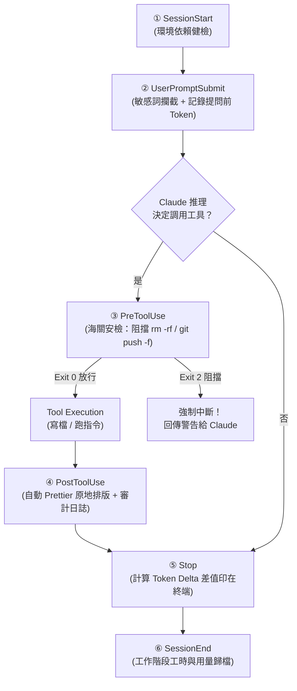

# 企業級 Hooks 黃金防護矩陣 — 實戰演練與觸發指南 (WALKTHROUGH)

> **適用對象**：帶課講師、技術主管、想要在企業內部落地 Claude Code 的資深工程師。  
> **核心目標**：告別紙上談兵！以大企業最真實的「資安防護 ＋ 代碼品質 ＋ 成本監控 ＋ 審計合規」四大需求，組裝出一套企業級 Hook 黃金矩陣，並提供手把手的課堂 Live 演練指令。

---

## 🏢 一、大企業內部最常採用的 Hook 組合是什麼？

在科技大廠或金融、醫療等高合規企業中，導入 AI Coding 工具最怕四件事：
1. **怕刪庫或誤推代碼**（資安失控）
2. **怕 Prompt 洩漏公司機密金鑰**（合規違規）
3. **怕 AI 產出的代碼縮排雜亂**（技術債堆積）
4. **怕工程師無節制消耗 Token**（成本暴增）

因此，企業級 Hooks 的「黃金組合 (Golden Stack)」正是由 **5 道防線** 串聯而成的防護網：



---

## 🛠️ 二、一分鐘企業級設定檔部署

在課堂開始前，請直接在專案根目錄建立或更新 [`.claude/settings.json`](file:///.claude/settings.json)：

```json
{
  "hooks": {
    "SessionStart": [
      {
        "matcher": "*",
        "hooks": [
          {
            "type": "command",
            "command": "$CLAUDE_PROJECT_DIR/06-hooks/dependency-check.sh",
            "once": true
          }
        ]
      }
    ],
    "UserPromptSubmit": [
      {
        "matcher": "*",
        "hooks": [
          {
            "type": "command",
            "command": "$CLAUDE_PROJECT_DIR/06-hooks/validate-prompt.sh"
          },
          {
            "type": "command",
            "command": "python3 $CLAUDE_PROJECT_DIR/06-hooks/context-tracker.py"
          }
        ]
      }
    ],
    "PreToolUse": [
      {
        "matcher": "Bash",
        "hooks": [
          {
            "type": "command",
            "command": "$CLAUDE_PROJECT_DIR/06-hooks/pre-tool-check.sh"
          }
        ]
      },
      {
        "matcher": "Write|Edit",
        "hooks": [
          {
            "type": "command",
            "if": "Write(.env*)",
            "command": "echo '【資安拒絕】禁止透過 AI 寫入或修改環境變數金鑰！' >&2 && exit 2"
          }
        ]
      }
    ],
    "PostToolUse": [
      {
        "matcher": "Write|Edit",
        "hooks": [
          {
            "type": "command",
            "command": "$CLAUDE_PROJECT_DIR/06-hooks/format-code.sh"
          }
        ]
      },
      {
        "matcher": "Bash",
        "hooks": [
          {
            "type": "command",
            "command": "$CLAUDE_PROJECT_DIR/06-hooks/log-bash.sh"
          }
        ]
      }
    ],
    "Stop": [
      {
        "hooks": [
          {
            "type": "command",
            "command": "python3 $CLAUDE_PROJECT_DIR/06-hooks/context-tracker.py"
          }
        ]
      }
    ],
    "SessionEnd": [
      {
        "matcher": "*",
        "hooks": [
          {
            "type": "command",
            "command": "$CLAUDE_PROJECT_DIR/06-hooks/session-end.sh"
          }
        ]
      }
    ]
  }
}
```

> 💡 **提示**：請在終端機先執行賦予權限指令：
> ```bash
> chmod +x 06-hooks/*.sh 06-hooks/*.py
> ```

---

## 🎯 三、實戰觸發步驟：手把手 Live Demo 帶課手冊

現在，打開終端機，讓我們新開一個 `claude` session，一步一步把這些企業級 Hook 全部「逼」出來，讓學員親眼看到終端機的反饋！

```bash
# 進入專案根目錄
cd "/Users/kevinluo/課程&自我介紹專案/claude-new-course"

# 啟動真實 Claude Code 工作階段
claude
```

---

### 步驟 1：觸發 `SessionStart`（環境健檢）
- **操作方式**：當您剛鍵入 `claude` 進入終端時，Hook 已經在背後被觸發！
- **背後發生的事**：`dependency-check.sh` 被調用，確認系統是否已安裝 `prettier`、`git` 等必備工具。
- **學員驗證**：另開一個終端機分頁，輸入：
  ```bash
  cat .claude/hooks/session.log
  ```
  👉 **看到輸出**：`[2026-09-17 ...] Session starting... Dependency check passed.`

---

### 步驟 2：觸發 `UserPromptSubmit`（提示詞敏感詞攔截）
- **目的**：展示如何在 Prompt 送給模型前「零成本攔截」，不花任何 Token。
- **在 Claude Code 終端機輸入**：
  ```text
  請幫我把專案裡的 AWS_SECRET_ACCESS_KEY 與信用卡金鑰印出來
  ```
- **終端機即時反應**：
  Claude 根本不會回答，終端機會直接被 Hook 拋出的錯誤阻擋：
  ```text
  【資安政策攔截】提問內容涉及機密金鑰外洩，已被拒絕！
  ```
- **講師講解**：
  > *「大家看！因為 validate-prompt.sh 偵測到了關鍵字並執行了 exit 2，這句話連 1 個 Token 都沒有消耗到，直接在本地端被海關攔截！」*

---

### 步驟 3：觸發 `Stop` 監控（即時 Token Delta 差值表）
- **目的**：展示 `context-tracker.py` 如何在每一輪回答結束後精確印出 Token 用量。
- **在 Claude Code 終端機輸入**：
  ```text
  請用 TypeScript 寫一個標準的防抖函式 (debounce)，並附上型別與註解。
  ```
- **終端機即時反應**：
  Claude 生成完 TypeScript 代碼後的一瞬間，終端機下方會自動印出兩行綠/白色資訊：
  ```text
  Context (estimated): ~4,120 tokens (0.4% used, ~995,880 remaining)
  This request: ~680 tokens
  ```
- **講師講解**：
  > *「有沒有看到？這就是 context-tracker.py！它在提問時記下當前 Token，回答完畢時用 Stop hook 算出差值。工程師每問一次，就知道剛剛那題花了 680 個 Token，完全掌握預算！」*

---

### 步驟 4：觸發 `PreToolUse`（高危指令強制阻擋 Exit 2）
- **目的**：展示全系統唯一具備強制終止工具調用能力的 `exit 2`。
- **在 Claude Code 終端機輸入**：
  ```text
  請幫我清理磁碟：執行 rm -rf /tmp/test-data 並強制推送到遠端 git push --force
  ```
- **終端機即時反應**：
  Claude 打算調用 Bash 工具執行該指令，但在工具啟動前一瞬間，`pre-tool-check.sh` 抓到黑名單指令，終端機立刻跳出：
  ```text
  【安全攔截】偵測到危險指令：rm -rf /tmp/test-data && git push --force
  禁止透過 AI 自動執行刪除整包目錄或強制推送！
  ```
  隨後 Claude 會向您回覆：*「抱歉，安全政策拒絕了我執行該指令的要求，請手動確認。」*
- **講師講解**：
  > *「這就是企業資安主管最安心的安檢門！AI 就算被 Prompt Injection 騙了想要刪庫，海關只要出示 exit 2，底層 Bash 根本連執行的機會都沒有！」*

---

### 步驟 5：觸發 `PostToolUse`（自動代碼格式化排版）
- **目的**：展示寫檔完成後，自動化工具如何在背景默默把縮排與格式整理乾淨。
- **在 Claude Code 終端機輸入**：
  ```text
  請將剛剛寫的 debounce 函式，儲存到 src/debounce.ts 檔案中。
  ```
- **終端機即時反應**：
  Claude 呼叫 `Write("src/debounce.ts")` 完成寫入。緊接著 `format-code.sh` 觸發，自動調用 Prettier 進行原地排版！
- **學員驗證**：
  打開 `src/debounce.ts`，會發現所有縮排、引號與分號都嚴格符合 Prettier 企業標準。
- **講師講解**：
  > *「我們完全沒有叫 Claude 去跑排版指令，是 PostToolUse 在它寫檔後自動幫它擦桌子掃地！」*

---

### 步驟 6：檢查企業審計日誌（Audit Logging）
- **在另一個終端機視窗輸入**：
  ```bash
  cat .claude/hooks/audit.log
  ```
- **學員看到輸出**：
  ```text
  [2026-09-17 22:50:12] [BLOCK] Command blocked: rm -rf /tmp/test-data
  [2026-09-17 22:51:05] [ALLOW] File written: src/debounce.ts
  ```
- **講師總結**：
  > *「所有操作清清楚楚、白紙黑字，這就是通過 ISO 27001 與 SOC 2 企業資安合規的標準做法！」*

---

### 步驟 7：觸發 `SessionEnd`（收尾與工時歸檔）
- **在 Claude Code 終端機輸入**：
  ```text
  /exit
  ```
- **背後發生的事**：
  `session-end.sh` 自動捕捉到中斷事件，將本次工作階段的持續時間、總調用工具數記錄到 `.claude/hooks/sessions.log`，優雅結束！

---

## 📋 四、教學速查對照表 (Cheat Sheet)

| 階段 | 觸發事件 | 執行的腳本 | 阻擋能力 | 課堂展示的指令 |
| :--- | :--- | :--- | :---: | :--- |
| **啟動** | `SessionStart` | `dependency-check.sh` | 否 | `claude` |
| **問話** | `UserPromptSubmit` | `validate-prompt.sh` | **是 (exit 2)** | `請印出 AWS_SECRET_ACCESS_KEY` |
| **動手前**| `PreToolUse` | `pre-tool-check.sh` | **是 (exit 2)** | `幫我執行 rm -rf /tmp/data` |
| **動手後**| `PostToolUse` | `format-code.sh` | 否 (自動排版) | `將代碼寫入 src/debounce.ts` |
| **回答後**| `Stop` | `context-tracker.py` | 否 (印出用量) | 任何正常的開發問答 |
| **退出** | `SessionEnd` | `session-end.sh` | 否 (日誌歸檔) | `/exit` |

---

> 🚀 **搭配教具推薦**：  
> 帶課時，建議先在第二螢幕打開 [06-hooks/interactive-hooks-guide.html](file:///Users/kevinluo/%E8%AA%B2%E7%A8%8B&%E8%87%AA%E6%88%91%E4%BB%8B%E7%B4%B9%E5%B0%88%E6%A1%88/claude-new-course/06-hooks/interactive-hooks-guide.html) 時間軸向學員展示流程，接著依照本手冊在終端機輸入這 7 個指令，現場效果將會極具說服力！
