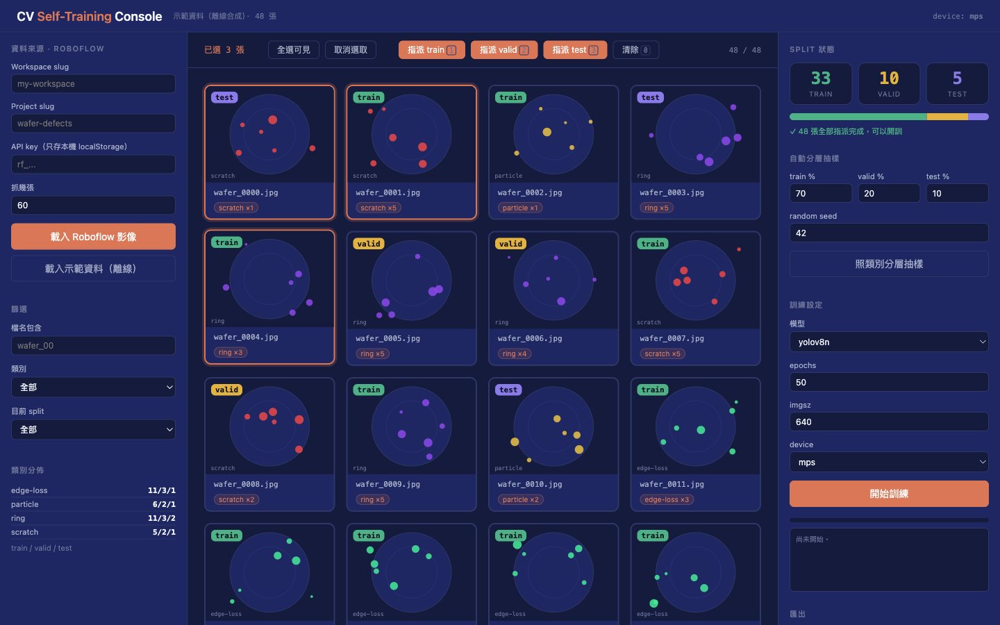

# 在 Claude Code 裡用 Claude Design 畫出「CV 自我訓練介面」Walkthrough

> **對象**：用過 Claude Code、看得懂 HTML/CSS 但不想手刻 UI 的工程師 / ML 工程師 / 想學 design-to-code 一條龍的人
> **形式**：講師現場帶，學員邊聽邊做（一人一台筆電）
> **時長**：90 分鐘（Phase 0–7；只講不做可壓到 45 分鐘）
> **產出**：一個可跑的 **CV Self-Training Console** — 從 Roboflow 載圖 → 前端預覽 → 自己指派 train/valid/test → 匯出 `splits.json` / `data.yaml` → 送去訓練。外加一份能重複使用的 design system。
> **核心方法**：**先定設計系統，再讓 AI 畫**。不是「叫 Claude 寫一個好看的頁面」，是「把品牌變成資產、讓每次生成都自動長對」。

---

## 開場（5 分鐘）：這跟「叫 Claude 幫我寫 HTML」差在哪？

| 路線 | 怎麼做 | 第 3 次改版會發生什麼事 |
|---|---|---|
| 叫 Claude 寫 HTML | 「幫我做一個資料標註介面，要好看」 | 每次顏色都不一樣、按鈕有 4 種寫法、間距靠 AI 心情 |
| 用 Figma 畫完再手刻 | 設計師畫 → 工程師刻 → 對不起來 → 來回三輪 | 設計稿跟 code 永遠差一版 |
| **Claude Design（這份）** | 設計系統先上雲 → 講 brief → 畫布上改 → 交付回 Claude Code | 顏色永遠對，因為顏色不是 AI 挑的，是你 token 裡定的 |

> **教學金句**：「Claude Design 不是『比較會畫圖的 Claude』——是『你先把品牌變成資產，AI 才有東西可以遵守』。少了設計系統這步，它就退化成一個會配色的實習生。」

今天要蓋的東西（成品長這樣）：



四件事，缺一不可：
1. **載得到圖** — 直接打 Roboflow API 抓指定 project 的影像
2. **看得到資料** — 縮圖牆 + 類別 chip + 目前 split badge + 類別分佈
3. **分得了組** — 手動點選 / 鍵盤 1・2・3 / 照類別分層抽樣
4. **送得出去** — `splits.json` + YOLO `data.yaml`，接得上真的訓練

---

## 📁 檔案結構：兩個資產、一條流水線

```
claude-design_claude-code/
├── design-system/              ← 資產 1：品牌。會被 /design-sync 推上 claude.ai/design
│   ├── tokens.css              (色票 / 間距 / 字級 — 單一真相)
│   ├── colors.html             (@dsCard group="Colors")
│   ├── buttons.html            (@dsCard group="Components")
│   └── image-card.html         (@dsCard group="Components" — CV 介面的核心元件)
├── prototype/
│   └── index.html              ← 資產 2：成品。單檔、零依賴、可離線 demo
├── screenshot.png
└── WALKTHROUGH.md              ← 你在讀的
```

流水線：

```
tokens.css + 3 個元件
        │  /design-sync
        ▼
claude.ai/design 的 design system
        │  /design <brief>
        ▼
畫布上的第一版介面
        │  聊天 / 內嵌評論 / 直接拖拉
        ▼
你滿意的設計
        │  Deliver to Claude Code
        ▼
prototype/index.html（接真 API、能跑）
```

> **教學金句**：「箭頭只有一個方向，但每一段都可以往回踩。回頭改 token，整條線上的東西一起變——這就是為什麼第一步不能跳。」

---

## Phase 0：環境準備（10 分鐘）🧠

### 0.1 版本與方案

| 必備 | 怎麼確認 | 沒有會怎樣 |
|---|---|---|
| Claude Code ≥ 2.1.x | `claude --version` | 沒有 `/design` 系列指令 |
| Pro / Max / Team / Enterprise | claude.ai 帳號頁 | Design 是 beta，Free 沒有 |
| Enterprise 使用者 | 問你們 admin | **Enterprise 預設是關的**，要 admin 開 |
| 瀏覽器（看畫布用） | Chrome / Safari 皆可 | Claude Design 只有網頁 + 桌面版 |

### 0.2 確認指令真的在

在 Claude Code 裡打 `/design` 然後按 Tab，你應該看到這四個：

| 指令 | 做什麼 |
|---|---|
| `/design <要做什麼>` | 從一句 brief 生一個全新 Design artifact |
| `/design-login` | 幫 `/design-sync` 授權 design-system 存取 |
| `/design-sync ["專案提示"]` | 把本機元件庫推上 claude.ai/design |
| `/design-consent` / `/design-revoke` | 開 / 收 Claude agent 對你 Design 專案的存取 |

⚠️ **我在課前實測過**：`/design-sync` 的參數是「專案提示」（例如 `"CV Console DS"`），**不是** brief。打 `/design-sync 做一個儀表板` 它會糾正你。

### 0.3 授權

```
/design-login
```

瀏覽器會跳出授權頁，按同意。之後 `/design-sync` 就自動帶這組憑證。

⛔ **這步不能跳、也不能叫 Claude 代跑。** `/design-login` 是互動式 slash command，只有你本人打得出來。沒跑就先叫 Claude 同步，它會直接回：

```
DesignSync needs design-system authorization.
Run /design-login to authorize it with your claude.ai account
```

上課時**把這個錯誤當場示範一次**——順序是 `/design-login` → `/design-sync`，反了就卡在這。

💡 之後如果看到 `HTTP 403 ... rejected your /design-login credential`，99% 是憑證過期或帳號沒有 Design 權限，**重跑 `/design-login`**，不要在 prompt 裡瞎猜。

### 0.4（選用）把 Design MCP 掛上

想從終端機直接建立 / 編輯設計、不想開瀏覽器：

```bash
claude mcp add --scope user --transport http claude-design https://api.anthropic.com/v1/design/mcp
```

然後在 session 裡跑 `/design-login`。

> **教學金句**：「`/design-sync` 是把**你的東西推上去**，`/design` 是**叫它畫新的**，MCP 是**不用開瀏覽器**。三件事，別混。」

---

## Phase 1：先定設計系統 ⭐ 最詳細（20 分鐘）🎨

**這是整堂課最重要的一段。**先別碰介面。

### 1.1 為什麼 CV 介面特別需要 token？

因為這種介面有一堆**語意色**——train 是什麼顏色、valid 是什麼顏色、「未指派」是什麼顏色。這三個顏色會同時出現在：縮圖 badge、統計大數字、比例條、類別分佈表、篩選下拉。

**五個地方。** 你如果讓 AI 每次自己挑，第三次改版就會出現「badge 是綠的但統計數字是藍的」。

### 1.2 寫 `design-system/tokens.css`

```css
:root {
  /* Brand — Midnight Executive（和 PPT 同一套） */
  --ds-navy-900:  #141B3D;   /* app 背景 */
  --ds-navy-800:  #1E2761;   /* 面板 */
  --ds-coral:     #D97757;   /* 主要動作 */

  /* Split 語意色 — 整個 app 只認這四個 */
  --ds-train:      #4FB286;
  --ds-valid:      #E3B341;
  --ds-test:       #8B7BE8;
  --ds-unassigned: #5A628C;

  /* Space (4pt grid) */
  --ds-1: 4px; --ds-2: 8px; --ds-3: 12px; --ds-4: 16px; --ds-5: 24px; --ds-6: 32px;

  /* Type */
  --ds-mono: Menlo, ui-monospace, "SF Mono", monospace;   /* code 一律 Menlo */
}
```

完整版在 `design-system/tokens.css`。

⚠️ **關鍵命名紀律**：顏色叫 `--ds-train` 不叫 `--ds-green`。**語意命名**，不是外觀命名。這樣你哪天想把 train 改成藍的，改一行就好，不用去找「哪些綠色是 train 哪些綠色是成功訊息」。

### 1.3 寫元件預覽，每個檔第一行加 `@dsCard`

Claude Design 的元件面板是靠**每個預覽 HTML 的第一行註解**建索引的：

```html
<!-- @dsCard group="Components" name="Image card" subtitle="縮圖 + split badge + class chips + 選取態" -->
<link rel="stylesheet" href="tokens.css">
<style> /* ... */ </style>
<div class="grid">
  <div class="card sel">
    <div class="thumb"><span class="badge" style="background:var(--ds-train)">train</span></div>
    <div class="meta"><div class="name">wafer_0012.jpg</div>
      <div class="chips"><span class="chip">scratch ×2</span></div></div>
  </div>
  <!-- valid / 未指派 各一張 -->
</div>
```

⚠️ **這裡最容易偷懶**：只畫一個「正常狀態」。**一定要把狀態畫全**——選取 / 未選取、train / valid / test / 未指派、有標註 / 未標註。因為 AI 生介面時只會用你給的狀態；你沒畫「未指派」，它就自己發明一個灰色。

三個元件夠了，不要一次畫 20 個：

| 檔案 | group | 為什麼是這三個 |
|---|---|---|
| `colors.html` | Colors | 色票 + split 語意色一次看完 |
| `buttons.html` | Components | primary / ghost / danger × 2 尺寸 |
| `image-card.html` | Components | **CV 介面的核心**，整個畫面 80% 是它 |

> **教學金句**：「元件不是畫越多越好——畫『這個 app 裡出現超過 3 次的東西』就夠了。剩下的讓 AI 組。」

---

## Phase 2：`/design-sync` 推上雲（10 分鐘）🔌

```
/design-sync "CV Console DS"
```

引號裡是**專案提示**，用來對應到 claude.ai/design 上的哪個 design-system 專案。沒有就會問你要不要建新的。

它會做三件事，**每一步都會停下來讓你看**：

1. `list_projects` → 列出你可以寫入的 design-system 專案
2. `finalize_plan` → **把要寫哪些路徑、從哪個本機目錄讀，攤開給你確認**
3. `write_files` → 上傳

### 這一步的三個重點

| 重點 | 說明 |
|---|---|
| **增量，不是整包蓋掉** | 它一次同步一個元件。你只改了 `image-card.html`，就只推那一個 |
| **plan 要真的看** | `finalize_plan` 那一頁列的路徑清單，是你最後一道防線。看到不該出現的路徑就中止 |
| **專案型別不可改** | design system 專案的型別是**建立當下決定、之後改不了**。推到一般專案不會自動變成 design system |

💡 同步完去 claude.ai/design 開那個專案，右邊「Design System」面板應該長出 Colors / Components 兩組卡片。**沒長出來 = `@dsCard` 那行沒寫在第一行。**

> **教學金句**：「`finalize_plan` 不是煩人的確認框，是你唯一一次看到『它到底要寫哪些檔』的機會。點太快，之後只能用 git 救。」

---

## Phase 3：寫 brief，生第一版（15 分鐘）📝

### 3.1 好 brief 的四件事

官方講的：**目標 / 版面 / 內容 / 受眾**。翻成人話——

| 要素 | 爛寫法 | 好寫法 |
|---|---|---|
| 目標 | 「做一個 CV 介面」 | 「做一個讓 ML 工程師自己分配訓練資料的 console」 |
| 版面 | （不寫） | 「三欄：左邊資料來源+篩選、中間縮圖牆、右邊 split 統計+訓練設定」 |
| 內容 | 「顯示圖片」 | 「每張縮圖要有：檔名、類別 chip（含數量）、目前 split 的彩色 badge」 |
| 受眾 | （不寫） | 「一次要看 200 張圖的標註工程師，桌機為主」 |

### 3.2 直接用這段 brief（可整段貼）

```
/design 一個給 ML 工程師用的「CV Self-Training Console」，深色桌面版工具，三欄版面。

左欄（270px，資料來源與篩選）：
- Roboflow 連線表單：workspace slug、project slug、API key（密碼欄）、抓幾張
- 主要按鈕「載入 Roboflow 影像」+ 次要按鈕「載入示範資料（離線）」
- 篩選區：檔名關鍵字、類別下拉、目前 split 下拉
- 底部「類別分佈」清單，每列顯示 類別名 + train/valid/test 張數

中欄（彈性寬，影像牆）：
- 上方工具列：已選張數、全選可見、取消選取、四顆指派按鈕（train / valid / test / 清除），
  每顆右側用小鍵盤標籤標示快捷鍵 1 2 3 0，最右邊顯示「可見數 / 總數」
- 下方 responsive 縮圖網格（最小 150px），用 design system 的 Image card 元件：
  4:3 縮圖、左上角 split 彩色 badge、檔名用 mono 字體、類別 chip 顯示「類別 ×數量」
- 選取態用 coral 外框 + 外光暈

右欄（320px，分割與訓練）：
- 「Split 狀態」：train / valid / test 三個大數字卡片，各自用對應語意色
- 一條四段堆疊比例條（train / valid / test / 未指派）
- 一行健康狀態訊息：還有 N 張未指派就顯示黃色警告，全部指派完顯示綠色可開訓
- 「自動分層抽樣」：train% / valid% / test% 三個並排輸入 + random seed + 一顆按鈕
- 「訓練設定」：模型下拉（yolov8n/s/m）、epochs、imgsz、device（mps/cpu/cuda）、主要按鈕「開始訓練」
- 進度條 + mono 字體的訓練 log 區塊
- 「匯出」：下載 splits.json、下載 data.yaml 兩顆次要按鈕

配色與間距一律用已同步的 design system token，特別是 train/valid/test/unassigned 四個語意色，
不要自己發明顏色。介面文字用繁體中文，技術名詞保留英文。
```

### 3.3 為什麼這段 brief 這麼長？

因為**長度換的是來回次數**。這段大概 400 字，換掉 5–6 輪「再往左一點」「顏色不對」。

⚠️ 但**不要**在第一版就寫互動邏輯（「點了要怎樣」）。第一版只要版面對、元件對。互動留到 Phase 4。

> **教學金句**：「brief 寫版面和內容，不要寫行為。行為是第二輪的事——第一版你只是要一張『對的骨架』。」

### 3.4 如果你的帳號還沒有 Design artifact 型別

**我實測過，這是真的會遇到的**：有些帳號跑 `/design` 會回「這個帳號還沒有 Design 型別」。

不要卡住，**Plan B 一樣能上課**：把同一段 brief 直接丟給 Claude Code，加一句「輸出成單一 HTML 檔 `prototype/index.html`，`<link>` 我本機的 `design-system/tokens.css`」。**設計系統的價值一樣拿得到**，差別只是沒有畫布可以拖拉。

---

## Phase 4：三種改法，各有各的場子（15 分鐘）🛠

第一版一定不對。重點是**用對工具改**。

| 工具 | 什麼時候用 | 例句 |
|---|---|---|
| **聊天** | 結構性改動、加整塊區域、要它解釋或給選項 | 「把 Split 狀態整塊移到中欄上方，右欄只留訓練設定」<br>「給我 2–3 個縮圖牆的版面變體比一比」<br>「幫我檢查這個畫面的無障礙性和對比度」 |
| **內嵌評論** | 針對畫布上某個具體元件的小改 | 「這個 badge 的內距再大一點」<br>「這裡改成下拉，不要 radio」<br>「這一塊做成可摺疊」 |
| **畫布直接編輯** | 純視覺微調：拖、拉、對齊 | 三個統計卡片要等寬對齊，用拖的比講的快 10 倍 |

### 這個 CV 介面實際會改的三輪

**第 1 輪（聊天，結構）**
```
縮圖牆的網格請用 grid-auto-rows: max-content，
不然 card 的 overflow:hidden 會讓 row 被壓扁成一條。
另外把類別分佈從右欄移到左欄底部，右欄已經太擠。
```

**第 2 輪（內嵌評論，元件級）**
- 點縮圖 badge →「字體改 mono，加粗，底色用 split 語意色、文字用深色」
- 點健康狀態那行 →「未指派 > 0 顯示黃色，valid = 0 顯示黃色提醒『沒有驗證集你看不到 overfit』，全部好顯示綠色」

**第 3 輪（直接編輯）**
- 三個大數字卡片手動拉成等寬
- 比例條往上移到緊貼統計卡片

⚠️ **已知 bug，先講在前面**：內嵌評論**偶爾會在 Claude 讀到之前就消失**。官方建議的 workaround 是——**直接把那句話貼到聊天裡**。上課示範時建議故意講這件事，學生遇到才不會以為自己壞掉。

### 想換方向又怕弄丟現在這版？

```
先把我們現在這版存起來，然後試一個完全不同的方向：
把三欄改成上下兩段，上面是全寬影像牆，下面是分割控制列。
```

它會存好、跟你講存在哪，你之後可以在對話裡直接叫回來。

> **教學金句**：「改設計不是『再跟 AI 講一次』——是挑對管道。結構用聊天、元件用評論、對齊用手拖。用錯管道，一句話能講完的事要來回五輪。」

---

## Phase 5：接上真的 Roboflow 資料（15 分鐘）🔍

設計好看沒用，**要真的載得到圖**。

### 5.1 API 長這樣（我實測過的）

```
POST https://api.roboflow.com/{workspace}/{project}/search?api_key=YOUR_KEY
Content-Type: application/json

{
  "limit": 60,
  "offset": 0,
  "fields": ["id","name","owner","url","split","tags","annotations"]
}
```

`fields` 可選值：`id` `name` `annotations` `labels` `split` `tags` `owner` `url` `embedding` `created`
（不指定的話**預設只回 `["id","created"]`** — 你會拿到一堆沒有圖的 id，這是第一個坑）

回傳：

```json
{
  "offset": 0,
  "total": 292,
  "results": [
    {
      "id": "image123",
      "name": "wafer_0012.jpg",
      "owner": "owner123",
      "url": "https://source.roboflow.com/owner123/image123/original.jpg",
      "annotations": { "count": 5, "classes": { "scratch": 1, "particle": 4 } },
      "tags": ["cam_x13"]
    }
  ]
}
```

### 5.2 三個實測結論

| 問題 | 實測結果 | 所以 |
|---|---|---|
| 瀏覽器能直接打嗎？ | **能**。preflight 回 `access-control-allow-origin: *` | **不用寫 proxy**，前端 fetch 就好 |
| 圖片 URL 哪來？ | `url` 欄位直接給 | 別自己拼路徑，拼錯就白圖 |
| 類別怎麼拿？ | `annotations.classes` 是 `{類別: 數量}` | chip 直接顯示「scratch ×4」 |

### 5.3 API key 的安全邊界 ⛔

key 放在前端 = **任何看得到這個頁面的人都拿得到你的 key**。

| 場景 | 可以嗎 |
|---|---|
| 本機 `localhost` 自己用 | ✅ 可以，存 `localStorage` 方便 |
| 部署到公開網址 | ⛔ **絕對不行** |
| 要給別人用 | 後端加一層 proxy，key 放 server 端 env |

`.env.example` 有寫，`.gitignore` 有擋 `.env`。**示範時故意把這段唸出來**。

### 5.4 沒有 Roboflow 帳號的學生怎麼辦

按「載入示範資料（離線）」。`prototype/index.html` 內建 48 張**用 SVG 即時合成的假晶圓圖**（帶類別、帶缺陷點、seed 固定），完全離線、零帳號、零網路。教室 WiFi 爛掉也能上完整堂課。

> **教學金句**：「教學用的 demo 一定要有離線模式。不是為了你，是為了那個 API key 申請不過、卻還要跟上進度的同學。」

---

## Phase 6：分層抽樣 — 唯一該小心的邏輯（10 分鐘）⚙️

UI 可以隨便改，**這段不行**。隨機切資料切錯，模型跑出來的數字全是假的。

### 6.1 為什麼不能直接 `shuffle().slice()`

假設你有 48 張圖、4 個缺陷類別，其中 `scratch` 只有 8 張。純隨機切 70/20/10：

- `scratch` 全部掉進 train 的機率不低
- → valid / test 裡**一張 scratch 都沒有**
- → mAP 看起來很漂亮，因為根本沒考這一題

**照類別分層（stratified）**才對：每個類別**各自**照 70/20/10 切。

### 6.2 兩個容易寫錯的點

```js
// 1) 最大餘數法 — 不然三份加起來會少一張
const raw = { train: n*0.7, valid: n*0.2, test: n*0.1 };
const cnt = { train: Math.floor(raw.train), valid: Math.floor(raw.valid), test: Math.floor(raw.test) };
let left = n - cnt.train - cnt.valid - cnt.test;       // 餘數
const order = ['train','valid','test'].sort((a,b) => (raw[b]-cnt[b]) - (raw[a]-cnt[a]));
for (let i = 0; i < left; i++) cnt[order[i % 3]]++;     // 小數部分大的先拿

// 2) 固定 seed — 不然你重跑一次結果就變了，實驗不可重現
function mulberry32(a){ /* 32-bit PRNG，8 行 */ }
```

⚠️ 直接 `Math.random()` 是**最常見的錯**。你今天跑出 mAP 0.89，明天重跑變 0.84，你會以為是模型問題，其實是資料切法變了。

### 6.3 一定要留一個能跑的檢查

打開這個網址：

```
prototype/index.html?selftest=1
```

會跑 9 條 assert 然後印 PASS/FAIL：

```
PASS  每張都被指派到剛好一個 split
PASS  總數守恆（18）
PASS  train 約 70%（得到 13/18）
PASS  分層：a 類 10 張裡 train 應 ~7（得到 7）
PASS  只有 1 張的類別也有去處        ← 邊界：某類只有 1 張
PASS  同 seed → 完全相同結果
PASS  不同 seed → 結果不同
PASS  比例 100/0/0 → 全進 train
PASS  比例全 0 → 丟錯而不是靜默壞掉   ← 壞要壞得大聲

✅ 全部通過
```

沒有 framework、沒有 fixture、沒有 `npm install`。**一個 query string，9 條 assert。**

> **教學金句**：「UI 錯了你一眼看得出來，資料切錯你三個禮拜後才會發現。所以介面可以憑感覺改，`stratifiedSplit` 一定要留 assert。」

---

## Phase 7：交付與匯出（5 分鐘）📄

### 7.1 從 Claude Design 交付回 Claude Code

畫布右上角 **Export** → **Deliver to Claude Code**：
- **Send to local coding agent** — 直接進你現在這個 terminal session
- **Send to Claude Code Web** — 進 claude.ai/code

⭐ 重點：它是**接著你現有的工作繼續做**，不是拿截圖重畫。所以 `design-system/tokens.css` 會被真的 `<link>` 進去，不是被複製成一堆 hex 硬碼。

### 7.2 其他匯出格式

| 格式 | 拿來幹嘛 |
|---|---|
| `.zip` / 獨立 HTML | 自己接 code |
| PDF / PPTX | 給主管看、塞進簡報 |
| Canva / Miro / Figma | 給設計師接手 |
| Vercel / Replit / Lovable / Base44 / Wix | 直接丟上去變網站 |

可分享連結有三級權限：**僅檢視 / 可評論 / 可編輯**。給 stakeholder 用「可評論」，他們的意見會變成內嵌評論，你下一輪直接處理。

### 7.3 這個 console 匯出什麼

| 檔案 | 內容 | 下一步 |
|---|---|---|
| `splits.json` | 三份清單 + seed + 來源 + 時間戳 | 存進版控，實驗可重現 |
| `data.yaml` | YOLO 標準格式（path / train / val / test / nc / names） | `yolo train data=data.yaml` 直接吃 |

⚠️ 「開始訓練」按鈕在這份 prototype 裡是**模擬**的（吐假的 loss 曲線）。這是刻意的——**這堂課教介面，不教訓練**。真的訓練請接 `agent_group_projects/computer-vision-wafer-detection/`。

---

## 整合 demo：一條龍 10 分鐘跑完 ✅

課末當場示範一次，不解釋，只做：

```bash
# 1. 起本機 server（file:// 載不了外部圖）
cd claude-design_claude-code && python3 -m http.server 8777
```

```
# 2. 推設計系統
/design-sync "CV Console DS"

# 3. 生介面（貼 Phase 3.2 那整段 brief）
/design 一個給 ML 工程師用的「CV Self-Training Console」...

# 4. 改三輪：聊天改結構 → 評論改 badge → 拖拉對齊卡片

# 5. Export → Deliver to Claude Code
```

```
# 6. 瀏覽器開 http://127.0.0.1:8777/prototype/index.html
#    → 載入示範資料 → 照類別分層抽樣 → 下載 splits.json → 開始訓練
# 7. 開 ?selftest=1 給他們看 9 條 PASS
```

---

## 常見問題 FAQ

**Q1. `/design` 跟 `/design-sync` 到底誰先？**
`/design-sync` 先。先把 design system 推上去，`/design` 才有東西可以遵守。順序反了，第一版會是 AI 自己配的顏色，你得整個重來。

**Q2. 我沒有 design system，可以跳 Phase 1 嗎？**
可以，但你就只是在用「比較會畫圖的 Claude」。第一次做建議至少寫 `tokens.css` + 一個元件——**15 分鐘，換掉後面所有「顏色又不對了」**。

**Q3. Claude Design 吃掉多少額度？**
跟 Claude Code / Cowork **共用同一個池子**，沒有獨立 Design 配額（以前有，現在合併了）。專案越大、來回越多，吃越兇。

**Q4. 為什麼不用 Figma MCP 就好？**
不衝突。Figma 適合「設計師已經畫好、我要接進 code」；Claude Design 適合「沒有設計師，我要從 brief 直接長出東西」。這堂課教後者。

**Q5. 分層抽樣為什麼不呼叫 Roboflow 的 API 直接改 split？**
因為改雲端的 split 是**不可逆**的破壞性操作，上課示範風險太高。本機產 `splits.json` 更安全，也更接近真實工作流（split 應該進版控，不是藏在別人家的 SaaS 裡）。

**Q6. 這個介面能直接上 production 嗎？**
不行，缺三件：API key 的後端 proxy、真的訓練 runner、多人協作時的 split 衝突處理。它是**教學用原型**，但骨架是對的。

---

## 卡點對照表 ⭐（都是真的踩過的）

| 卡點 | 真實原因 | 處理 |
|---|---|---|
| 打 `/design` 沒反應 / 說沒有這個型別 | 帳號還沒開 Design beta，或 Enterprise 預設關閉 | 走 Phase 3.4 的 Plan B；Enterprise 找 admin 開 |
| 叫 Claude 幫你同步，它回 `DesignSync needs design-system authorization` | **`/design-login` 還沒跑**。而 `/design-login` 是 slash command，**只有你本人能在互動 session 裡打**，Claude 不能代跑 | 你自己打一次 `/design-login`，之後 Claude 才動得了 `/design-sync` |
| `/design-login` 明明成功了，建專案卻回 `403 permission_denied / subscription required for this action` | **授權 ≠ 有權限**。`/design-login` 只證明你這個 claude.ai 帳號登入成功；Design 是 Pro / Max / Team / Enterprise 才有的 beta，帳號方案不到就是 403 | 確認你 `/design-login` 用的**那個** claude.ai 帳號方案（不是 API key 的帳單帳號）；Enterprise 還要 admin 另外開。開不了就走 Phase 3.4 Plan B |
| `HTTP 403 ... rejected your /design-login credential` | 憑證過期，或帳號沒 Design 權限 | 重跑 `/design-login`，別在 prompt 裡猜 |
| `/design-sync 做一個儀表板` 被糾正 | 它的參數是**專案提示**不是 brief | 要生東西用 `/design <brief>` |
| 同步完元件面板空空的 | `@dsCard` 註解沒放在檔案**第一行** | 移到第一行重推 |
| 推上去的專案不是 design system | 專案型別**建立時就定死、改不了** | 用 `get_project` 先確認型別，或另建一個 |
| 內嵌評論寫了但 Claude 沒看到 | **已知 beta bug**，評論偶爾在被讀到前消失 | 官方 workaround：把同一句話**直接貼進聊天** |
| Roboflow 回了一堆只有 id 的結果 | `fields` 沒指定，**預設只回 `["id","created"]`** | 明確帶 `["id","name","owner","url","annotations"]` |
| 縮圖全白 | 自己拼 `source.roboflow.com` 路徑拼錯 | 直接用回傳的 `url` 欄位 |
| `file://` 開啟時圖全載不出來 | 本機檔案協定的 CORS 限制 | `python3 -m http.server 8777` |
| 縮圖 card 被壓成一條線 | `.card{overflow:hidden}` 讓 grid row 的最小高度變 0，row 被壓縮 | `.wall{grid-auto-rows:max-content}` |
| 重跑分層結果每次不一樣 | 用了 `Math.random()` | 換成帶 seed 的 PRNG（mulberry32） |
| train/valid/test 加起來少一張 | 三邊各自 `Math.floor()` | 最大餘數法補回餘數 |
| valid 裡某個類別 0 張 | 純隨機切，沒分層 | 照類別分層 |
| 「聊天上游錯誤」 | Design beta 的已知問題 | **同一個專案內**開新的聊天分頁 |
| 大 repo 連上去很卡 | 官方已知限制 | 從 Claude Code 用 `/design-sync` 同步，別在瀏覽器連整個 repo |

---

## 講師私房筆記 💡

**時間分配（90 分鐘實際跑過的節奏）**

| Phase | 分鐘 | 備註 |
|---|---|---|
| 開場 + Phase 0 | 15 | 環境檢查一定要當場跑，不要「回去自己裝」 |
| Phase 1 設計系統 | 20 | **最不能砍**。砍了後面全散 |
| Phase 2 sync | 10 | 卡在授權的人會多，留 buffer |
| Phase 3 brief | 15 | brief 整段貼，不要當場一個字一個字打 |
| Phase 4 三種改法 | 15 | 一定要三種都真的示範一次 |
| Phase 5 + 6 | 20 | Roboflow 沒帳號的人切離線模式 |
| Phase 7 + 收尾 | 10 | |

**故意踩的三個坑（比口頭講有效 10 倍）**

1. **先不寫 `@dsCard` 就 sync** → 面板空的 → 再加第一行重推。學生會記一輩子。
2. **先用 `Math.random()` 切** → 當場重跑兩次 → 讓他們看 train 張數在跳 → 再換 seed 版。
3. **第一版 brief 故意只寫「做一個 CV 標註介面」** → 看它生出什麼 → 再貼完整 brief → **兩張截圖並排**。這個對比是整堂課最有說服力的一頁。

**不同角色怎麼帶**

| 角色 | 重點放哪 | 可以跳過 |
|---|---|---|
| 前端工程師 | Phase 1–4（設計系統 + 三種改法） | Phase 6 分層細節 |
| ML 工程師 | Phase 5–6（API + 分層 + selftest） | Phase 2 的 plan 機制細節 |
| PM / 設計師 | Phase 3–4 + Phase 7 匯出分享 | Phase 6 整段 |
| 主管來觀課 | 開場對比表 + 整合 demo | 全部 Phase 細節 |

**我親自驗過的**

- Claude Code `2.1.268` 確認有 `/design`、`/design-login`、`/design-sync`、`/design-consent`、`/design-revoke` 五個指令
- `/design-sync` 的 `argumentHint` 是 `[<project hint, e.g. "Acme DS">]` — **參數是專案提示，不是 brief**
- `https://api.anthropic.com/v1/design/mcp` 回 401（端點活著，需要授權）
- **沒跑 `/design-login` 就叫 Claude 同步，會直接被擋**：`DesignSync needs design-system authorization`。而 `/design-login` 只有真人能在互動 session 裡打，agent 代不了 —— 所以 Phase 0.3 那步是真的不能跳
- Roboflow `POST /{ws}/{project}/search` 的 preflight 回 `access-control-allow-origin: *` — **瀏覽器可直連，不用寫 proxy**
- `prototype/index.html?selftest=1` 在 Chromium 上 **9 條全 PASS**
- 那個 grid row 被壓扁的 bug 是我在寫這份的時候**真的踩到的**，不是編的

---

## 一句話總結

> **先把品牌變成 token 推上雲，再讓 Claude Design 畫——這樣它畫的每一版都長得像你家的產品，而不是像 AI 的作品。介面可以憑感覺改，`stratifiedSplit` 一定要留 assert。**

---

## 進階閱讀

- 🔗 [Claude Design 官方入門](https://support.claude.com/en/articles/14604398-getting-started-with-claude-design)
- 🔗 [在 Claude Design 中設定設計系統](https://support.claude.com/en/articles/14604397-set-up-your-design-system-in-claude-design)
- 🔗 [Roboflow — Search a Dataset](https://docs.roboflow.com/datasets/manage/manage-datasets/dataset-search)
- 🔗 [使用量與長度限制怎麼算](https://support.claude.com/en/articles/11647753-how-do-usage-and-length-limits-work)

---

_Last updated: 2026-09-11_
_Maintainer: Kevin_
_配套教材（同目錄）：`README.md`、`design-system/`、`prototype/index.html`_
_專案實戰案例：`../agent_group_projects/computer-vision-wafer-detection/`（真的會跑訓練的 4-agent pipeline）_
_相關教案：`../docs/walkthroughs/auto_cv_cockpit_walkthrough.md`（同一個 CV 主題，但走 superpowers spec→plan→code 路線）_
